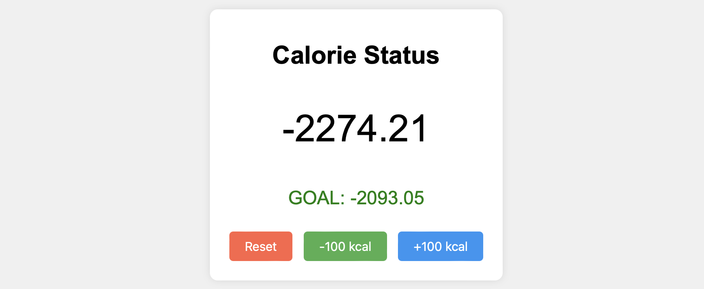

# calorie



Calorie deficit tracking web app.

You burn calories at a certain rate just by living - this is your base metabolic rate. For example for me that's roughly 2000 kcal/day. You can find [calculators](https://www.calculator.net/bmr-calculator.html) online. So, by default, your body will burn e.g. 2000 kcal/day. Then if you eat food you take in calories. And if you exercise you burn calories. If you are in a net deficit, you lose weight.

On top of that, you have a certain weight loss goal. For example for me that might be 500 kcal/day of deficit, so that every week you burn 7 * 500 = 3500 kcal, which is roughly 1 pound of fat.

So the idea is to have two counters that simply show your current deficit next to your goal. When you eat, you press +100kcal button until you add all the calories you ate. For example when I eat a Big Mac, I pres +100kcal button 5 times. When you exercise, you do the opposite. So if I went to the gym and ran for 30 min, the treadmill is showing me that I burned about 400 kcal, so I press -400kcal button 4 times.

I leave this little web app always open at the corner of my screen. At any point in time it shows me how much food I am allowed to eat to stay on my deficit goal. Alternatively if I know I am about to eat 1000 kcal, it shows me how many calories I have to go run for in order to not go over my goal.

Losing weight then becomes as simple as making sure that your number stays green (i.e. your deficit is inline with your goal) and does not turn red.

That's it! Depending on your base metabolic rate, go into [index.html](index.html) and edit the variable

```javascript
const hourlyCalorieBurn = 2000 / 24.0; // burned per hour
```

Change it from 2000 to whatever it is for you. Then decide what your deficit goal per day is, and edit it here:

```javascript
const hourlyCalorieTargetDeficit = 500 / 24.0; // burned per hour
```

Simply open up index.html in your browser and you are good to go.

### License

MIT
